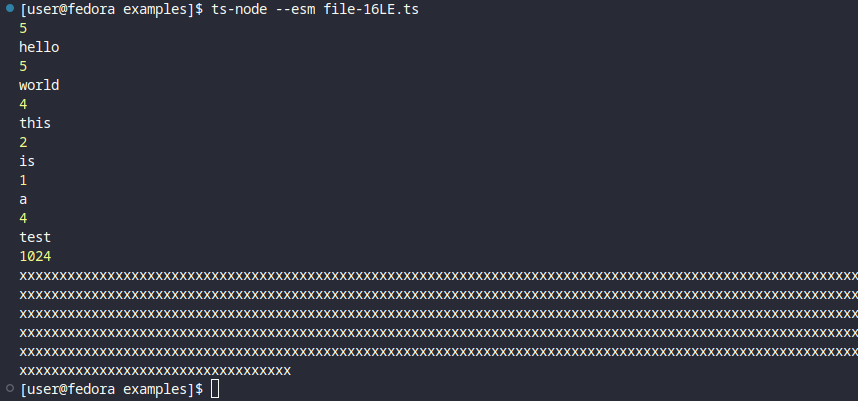

# Example of 16-bit little endian prefix for length

```js
import { FramedReader, FramedWriter } from "../src/index.js";
import { createReadStream, createWriteStream } from "fs";

function write() {
  const writer = new FramedWriter(createWriteStream("hello.txt"));
  writer.writeFunc = FramedWriter.write16LE;

  writer.writeBuffered("hello");
  writer.writeBuffered("world");
  writer.writeManyBuffered(["this", "is", "a", "test"]);
  writer.writeBuffered(Buffer.alloc(1024).fill("x"));

  writer.writeable.end(read);
}

function read() {
  const reader = new FramedReader(createReadStream("hello.txt"));
  reader.readFunc = FramedReader.read16LE;

  reader.on("error", (err) => console.log(err));
  reader.on("len", (len) => console.log(len));
  reader.on("data", (data) => console.log(data.toString()));
}

write();
```


